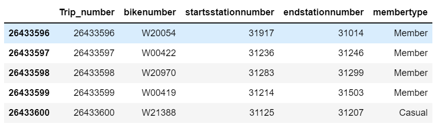
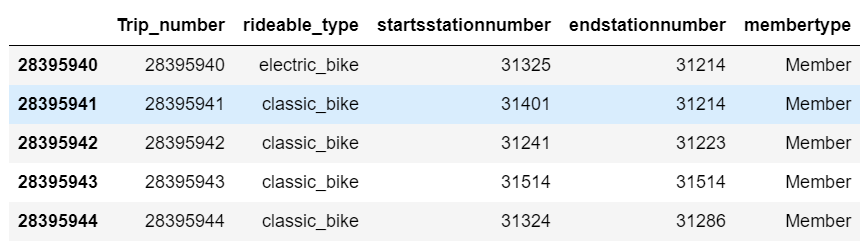
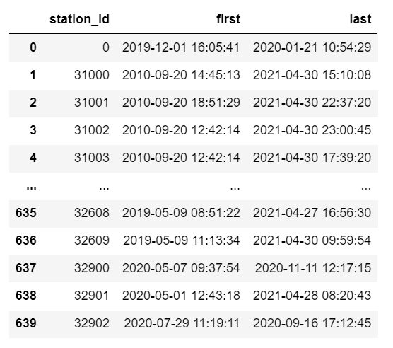

# FINAL PROJECT
## BIKESHARING SERVICES
An Analysis of Public Bike Sharing Services in Washington DC to uncover growing membership trends for potential business expansion

## REASONS FOR SELECTING TOPIC
We want to offer a deeper analysis to investors and the community on the growing membership trends of Public Bike Sharing Services in Washington DC in order to motivate investors to expand the availability of bike stations 

{Mair will insert additional content}

## VARIABLES TO CONSIDER
- Location of Bike Station (Latitude, Longitude, and Zip code)
- User types: Member and Casual
- Bike routes: Popular and Unpopular
- User number: Weekday and Weekend
- Time of day of the ride

## DESCRIPTION OF THE SOURCE DATA
For our analysis, we are using secondary data which has already been collected by the capital bike share website (https://www.capitalbikeshare.com/system-data). The data was stored in CSV format and we were able to find data from 2010 to 2021. 

For the years 2010 and 2011 the daily bike ride information of the whole year was gathered in a unique CSV file. From 2012 to 2017, the daily bike ride information was gathered in quarterly arranged CSV files and from 2018 to 2021 the bike ride information was collected in monthly CSV files. Data for the month of april 2020 was not available and year 2021 cut in the month of may.

In total, our final data was 66 CSV files with over 26,000,000 rows and 8 columns each.

### BikeSharing Data:
- Capital Bikshare (Washington D.C.) from 2010 - 05/2021. Retrieved from: https://s3.amazonaws.com/capitalbikeshare-data/index.html

## QUESTIONS TO ANSWER
Q. How does time of day influences the member type of riders in Washington D.C.?

Q. How does the weekday/weekend difference influence the membership type of riders in Washington D.C.?

Q. How does type of bike affect membership type?

H0: The member type of riders is not related to the time of the day of the ride. 

## ETL Process
1. Process Capital Bikeshare bike trip data sets to create one big dataset that contains all 28M trips with followings columns: 'Trip Number,' 'Starts station number,' 'End station number,' 'start date,' 'end date,' and 'member type' to enable us review when and where each bike trip took place and whether it was done by a member or a casual user. 
    - Downloaded the total 65 Capital Bikeshare bike trip dataset available from `Index of bucket "capitalbikeshare-data"` page of Capital Bikeshare website.
    - Create an index of the 65 files as a csv file to allow python code able to call files by each file's directory and file name. Then, process files with index 0-52 and 53-65 separately as those files have different columns. The list can be refered to the csv file <Resources/capitalbikeshare_dataset_index.csv>.
   ### Processing the files from Index 0-52
   - The files have unique column 'Bike number' which define which bike was used for each trip.
    ```
    # Drop unnecessary columns from the imported datasets and check data types
    df_dropped = merge_df[['Start station number','End station number','Start date','End date','Member type','Bike number']]
    
    # Take rows of 'Bike number' which are not NaN.
    df_cleaned = df_dropped[df_dropped['Bike number'].notna()]
    
    # Convert the 'started_at' and 'ended_at' columns to datetime data type
    df_cleaned['Start date'] = pd.to_datetime(df_cleaned['Start date'])
    df_cleaned['End date'] = pd.to_datetime(df_cleaned['End date'])

    # Rename columns match with the other table
    df_renamed = df_cleaned.rename(columns={'Start station number':'startsstationnumber',
                                            'End station number':'endstationnumber',
                                            'Start date':'startdate',
                                            'End date':'enddate',
                                            'Member type':'membertype',
                                            'Bike number':'bikenumber',
                                           })
    df_renamed = df_renamed[['startsstationnumber','endstationnumber',
                             'startdate','enddate','membertype','bikenumber']]
                             
    # Sort the table by the order of 'startdate' to list the trips in order of their ocuurence
    # then choose columns to keep for two tables: trip_later and rideable_type
    df = df_renamed.sort_values(by='startdate', ascending=True, na_position='first')
    df_reset = df.reset_index(drop=True)
    df_reset.index = df_reset.index + 1
    df_reset['Trip_number'] = df_reset.index
    columnsTitles = ['Trip_number','startsstationnumber','endstationnumber',
                    'startdate','enddate','membertype']
    trips_2010to202003 = df_reset.reindex(columns = columnsTitles)
      
    # Add column with Day of the Week
    trips_2010to202003['weekday'] = trips_2010to202003['startdate'].dt.day_name()
    ```
    ### Processing the files from Index 53-65
    - These files have unique column called 'rideable_type,' which describes which bike type was used. We extract this information separately to analyze how this variable affects the membership type of users.
    ```
    # Drop unnecessary columns for geo data table and check data types
    df_dropped = merge_df[['rideable_type','start_station_id','end_station_id','started_at','ended_at','member_casual']]

    # Take rows of 'start_station_id' and 'end_station_id' which are not NaN.
    df_cleaned = df_dropped[df_dropped['start_station_id'].notna()]
    df_cleaned = df_cleaned[df_cleaned['end_station_id'].notna()]
   
   # Remove a row with mixed data 
    df_cleaned = df_cleaned[~(df_cleaned == "MTL-ECO5-03").any(axis=1)]
    
    # Convert the 'started_at' and 'ended_at' columns to datetime data type
    df_cleaned['started_at'] = pd.to_datetime(df_cleaned['started_at'])
    df_cleaned['ended_at'] = pd.to_datetime(df_cleaned['ended_at'])
    
    # Rename columns match with the other table
    df_renamed = df_cleaned.rename(columns={'start_station_id':'startsstationnumber',
                                            'end_station_id':'endstationnumber',
                                            'started_at':'startdate',
                                            'ended_at':'enddate',
                                            'member_casual':'membertype'
                                           })
    df_renamed = df_renamed[['rideable_type','startsstationnumber','endstationnumber',
                             'startdate','enddate','membertype']]
    # Change the first letter of 'membertype' to upper case to match with the other tables
    df_renamed['membertype'] = df_renamed['membertype'].str.capitalize()
    
    # Sort the table by the order of 'startdate' to list the trips in order of their ocuurence
    # then choose columns to keep for two tables: trip_later and rideable_type
    df = df_renamed.sort_values(by='startdate', ascending=True, na_position='first')
    df_reset = df.reset_index(drop=True)
    # we begin the index from '26433601' to make the dataframe sequential to the previous dataframe
    df_reset.index = df_reset.index + 26433601
    df_reset['Trip_number'] = df_reset.index
    columnsTitles = ['Trip_number','startsstationnumber','endstationnumber',
                    'startdate','enddate','membertype']
    trips_202005to202105 = df_reset.reindex(columns = columnsTitles)
  
    # Add column with Day of the Week
    trips_202005to202105['weekday'] = trips_202005to202105['startdate'].dt.day_name()
    ```
    ### Merge the two dataframes together to make all_bike_trips file
    - merge the `trips_2010to202003.csv` and `trips_202005to202105.csv` files together 
 
2. Create two additional tables from `trips_2010to202003.csv` and `trips_202005to202105.csv` that represent 'Bike number' and 'rideable_type' of bikes respectively.
    ### Output 'bike_number' table 
    - Extract `bike_number` dataframe and ouput as csv from the previous extraction code.
    ```
    columnsTitlesBikeNumber = ['Trip_number','bikenumber','startsstationnumber',
                             'endstationnumber','membertype']
    bike_number = df_reset.reindex(columns = columnsTitlesBikeNumber)
    ```
    ### Output 'rideable_type' table 
    - Extract `rideable_type` dataframe and ouput as csv from the previous extraction code.
    ```
    columnsTitlesRideableType = ['Trip_number','rideable_type','startsstationnumber',
                             'endstationnumber','membertype']
    rideable_type = df_reset.reindex(columns = columnsTitlesRideableType)
    ```    
    
3. Create a dataset with list of `station_id` and corresponding latitude and longitude by utilizing the datasets from April 2020 to May 2021. Note the most recent file available is May 2021 and Capital Bikeshare started to record geographic information since April 2020.
    - Use the `merge_df` dataframe containing the files from index 53 to 65 to create a new dataframe with 'stationnumber' and its corresponding geocode.
   ```
   # Choose columns to keep for station_list table
    merge_df_dropped = merge_df[['start_station_id','end_station_id',
                                 'start_station_name','end_station_name',
                                 'start_lat','start_lng','end_lat','end_lng']]

    # Take rows of 'start_station_id' and 'start_lat' which are not NaN.
    df_cleaned = df[df['start_station_id'].notna()]
    df_cleaned = df_cleaned[df_cleaned['end_station_id'].notna()]
    station_table = df_cleaned[df_cleaned['start_lat'].notna()]
    
    # Splitting data by start stations and end stations
    start_stations = station_table[['start_station_id','start_station_name','start_lat','start_lng']]
    end_stations = station_table[['end_station_id','end_station_name','end_lat','end_lng']]
    
    # Rename columns to remove 'start' and 'end'
    start_stations = start_stations.rename(columns={'start_station_id':'station_id','start_station_name':'station_name','start_lat':'lat','start_lng':'lng'})
    end_stations = end_stations.rename(columns={'end_station_id':'station_id','end_station_name':'station_name','end_lat':'lat','end_lng':'lng'})
    
    # Combine the two tables together
    frames = [start_stations,end_stations]
    station_list = pd.concat(frames)
    station_list.sort_values(by='station_id', ascending=True, na_position='first')
    
    # Pick rows with only values
    station_list = station_list[station_list['station_id'].notna()]
    station_list['station_id'].isnull().sum()
    station_list.sort_values(by='station_id', ascending=True, na_position='first')
    
    # Drop the duplicate entries of 'station_id'
    station_list_cleaned = station_list.drop_duplicates(subset=['station_id'],
                                 keep = 'first')
    station_list_cleaned = station_list_cleaned.sort_values(by='station_id', 
                                                            ascending=True).reset_index().drop(columns=['index'])
   ```
4. Output an additional list of bike stations that displays the first day and the last day of their usage to identify if any stations have imbalance in number of data points due its length of operation.
    ```
    # From the 56M entries of trips, pick the first day and the last day
    station_dates = station_list_all.groupby(['station_id'])['started_at'].agg(['first','last'])
    
    # add 'station_id' as first column
    df = station_dates.assign(startstationnumber=station_id.values)
    station_active_dates = df[['station_id','first','last']].reset_index(drop=True)
    ```
5.  From the `all_bike_trips.csv` file, extract an additional dataframe that displays number of trips took by each staion number.
    ```
    # Count how many times the 'startsstationnumber' appears in the list to count the number of trips took place
    number_of_trips = pd.DataFrame(all_bike_trips['startsstationnumber'].value_counts())
    number_of_trips = number_of_trips.rename(columns={'startsstationnumber':'occurence'})
    number_of_trips['startsstationnumber'] = number_of_trips.index
    number_of_trips.reset_index(drop=True)
    ```

- Convert time date feature into a day of week column. 


Table #1 all_bikes_trips


Table #2 bike_number



Table #3 Rideable_type



Table #4 Station List


Table #5 Station List with its active dates




## Database Integration

Our database has been refined and currently, holds the following schema:


The connection between tables, the fields that have been kept and the data types are displayed in the image above. After cleaned and organized the raw data extracted from the citibike website, we created five tables that are ready for our analysis and load the in to PostgerSQL database. While we are working on our project we have also extracted different tables using SQL join query. Looking at the image below we can see the Table created by Inner join from our *station_list* and *station_list_active*.


## MACHINE LEARNING

ARIMA Model:
Part 1: Preprocessing (Completed)
1) Read in 'all_bike' csv
- Change Trip_number col to lowercase
1) Read in 'bike_type' csv
- Encode bike types
- Rename cols
1) Merge 'all_bike' and 'bike_type'
2) Drop unnecessary cols
3) Change 'startdate' from object to datetime
4) Set index to 'startdate'

Part 2: Split Train_Test

Part 3: Check for Stationarity

Part 4: Modeling/Forecasting

Part 5: Evaluate/Improve Forecasting/Predictions 


## DASHBOARD
The image below shows the comparision of number of trips by membership status and the bike type. The table contains the 10 years data of bike trip in Washington DC. As we can see in the image the mebers bike morethan the casual in all bike types. 


Visualization of Trip number change overtime by Member or Casual users


Visualization of Station and Member or Casual Users


