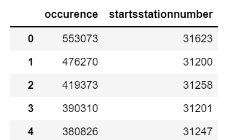
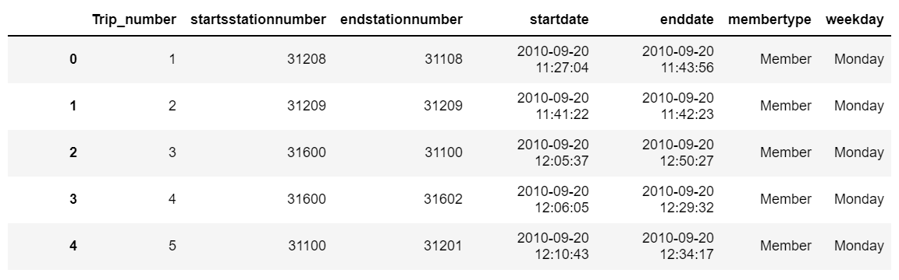
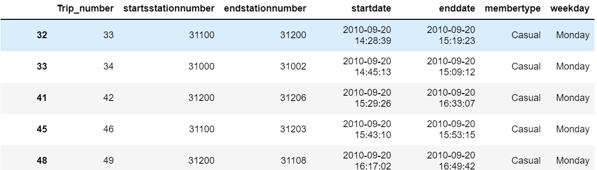
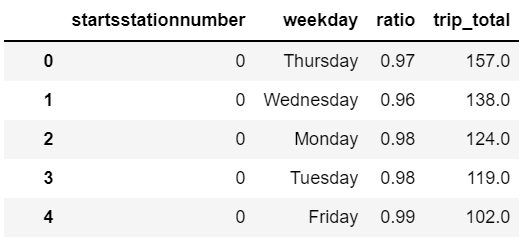

### Table 1: "all_bike_trips"
1. For the first table, we created an index of the 66 csv files to allow python to call the files by each individual directory and file name. 
2. Then, the files were processed. From index 0-52 and 53-65 separately as those files have different columns. The resulting CSV file can be refered to as: <Resources/capitalbikeshare_dataset_index.csv>.
3. The data points from index 0-52 had a unique column named 'Bike number', which showed which bike was used for each trip.
4. After cleaning the data and dropping unnecessary columns, the output was recorded as a dataframe under a CSV file called: `trips_2010to202003.csv`.
5. The data points from index 53-65 had a unique column named 'rideable_type,' which describes which bike type was used. We extracted this information separately to analyze how this variable affects the membership type of users.
6. After cleaning the data and dropping unnecessary columns, the output was recorded as a dataframe under a CSV file called: `trips_202005to202105.csv`.
7. Then, both resulting CSV filees were merged (the `trips_2010to202003.csv` and `trips_202005to202105.csv`).
8. Lastly, from the merged file, unnecessary columns were dropped, NaN rows cleaned up, mixed data type columns removed and datatype converted to give us our `Table1_all_bike_trips.csv`.

## Visual representation of the output:
Table #1 all_bikes_trips

 
### Table 4: station_list 
1. Noting that from April 2020 upto May 2021 is the time range in which Capital Bikeshare started to record geographic information, we created a dataset with the list of data for `station_id` which provides the latitude and longitude of each station.
2. We used the data from index 53 to 65 to create a new dataframe with 'stationnumber' and its corresponding geocode.
3. The output was a CSV file named: `Table4_station_list` which held columns: `stationnumber`, `lat`, and `lng` to refer to the location of each bike station.

## Visual representation of the output:
Table #4 Station List

### Table 6: number_of_trips
1.  From the `all_bike_trips.csv` file, we extracted an additional dataframe to display the number of trips taken in each staion number.
2.  We used the `value_counts()` method to list how many times each station appears over the 28M trips recorded in our dataset.
3.  The output was a dataframe with `startstationnumber` and `occurence` columns which was saved as a CSV file named: `Table6_number_of_trips.csv`.

## Visual representation of the output:
Table #6 Station List

### Table 7: member_trips and Table 8: casual_trips
1.  We created two separate datasets listing the trips done sorted by 'Member' and 'Casual' users separately.
2.  We used the `Table1_all_bike_trips.csv` and picked the `membertype` column to then separate them by `Member` and `Casual` separately and save them in two dataframes named: `Table7_member_trips.csv` and `Table8_casual_trips.csv` respectively.

## Visual representation of the output:
Table #7 Member Trips

Table #8 Casual Trips

### Table 9: ratio_df, Table 10: dayofweek_ratio, and Table 12: station_dayofweek_ratio_triptotal
1. We created a table listing the ratio of trips done by 'Member' users over all the recorded trips in each station.
2. We refered to the `Table7_member_trips.csv` and `Table8_casual_trips.csv` files to collect number of trips done at each station. We sorted each of those done by `Member` and `Casual` using the `value_counts()` method. 
3. Then, we calculated the ratio based on those values to figure out the ratio of `Member` usage by each station.
4. The output was a dataframe saved as `Table9_ratio_df.csv` file.

5. We create a table listing the ratio of trips done by 'Member' users over the all th recorded trip by each day of week.
6. We refered to the `Table7_member_trips.csv` and `Table8_casual_trips.csv` files to retrieve the ratio of `Member` users by each day of week.
7. The output was a dataframe saved as `Table10_dayofweek_ratio.csv` file.

8. We create a table listing the bike stations and their ratio of 'Member' usage for each day of week.
9. We refered to the `Table7_member_trips.csv` and `Table8_casual_trips.csv` files to calculate the number of `Member` usages and `Casual` usages for each bike station on each day of week.
10. We utilized the calculated dataframes and had for an output a new dataframe with columns of `startsstationnumber`, `weekday`, and the `ratio` of `Member` usage along `trip_total` to evaluate the significance. This CSV file was saved as `Table12_station_dayofweek_ratio_triptotal.csv`.

## Visual representation of the output:
Table #9 Ratio df

Table #10 Dayofweek Ratio

Table #12: Station Dayofweek Ratio TripTotal

### Table 15: merge_covid
1. We created a table that categorizes both the total number of trips and the ratio of trips done by 'Member' users by **the status: pre and post Covid** and by **Weekday or Weekend**.
2. We refered to the `Table7_member_trips.csv` and `Table8_casual_trips.csv` files again and grouped data from 2019/01-2019/12 as **pre-Covid** and 2020/01-2021/05 as **post-Covid**.
3. Then, merged both dataframes originated from `Table7_member_trips.csv` with the label `member` and `Table8_casual_trips.csv` with the label `casual`.

## Visual representation of the output:
Table #15 Merge Covid

# RESULTS OF ANALYSIS

## DASHBOARD
Note: To access the interactive Tableau Dashboard click on the following link: 

[link to Tableau Dashboard](https://public.tableau.com/views/PublicBikeSharingProjectLoationvs_Membership/Loc_Station_ratio?:language=en-US&publish=yes&:display_count=n&:origin=viz_share_link)

With the created tables, we used tableau tool to develop visual content to help us uncover the rationality of bike riders. 

With our first visual we uncovered the following:

### Number of trips by registered and casual riders
When crossing the number of trips done by both registered and casual riders we got the following visual:

As it can be seen, indeed the mayority of bike trips have been taken by member riders (registered) than by casual ones. This observation is a very predictive pattern considering that by thinking of 'membership' already speaks of a very loyal and frequent user audience.

Also, the 'member' type ratio increased steadily until 2019. This is also a predictive behaviour considering that year 2020, in the early months, was struck by the covid 19 pandemic.

Lastly, this visual also shows a predictive behaviour that is a low registry of bike rides during the 1st and 4th Quarters of the year. These timeframe corresponds to the winter months.

### Stations per member and casual users
Our second visual crossed the stations of the bike service per type of member.

As the dashboard shows, the stations with greater 'casual' users are those located closest to Points of Interest, such as the national mall, white house, tidal basin and 14th St. This is a predictive behavior as tourists would be less likely to be interested in obtaining a membership of a service that, once they fly back home, will not use again.

Secondly, the dasbhboard shows that stations with greater 'member' type of users are found closest to the corporate hubs, such as Union Station, Dupont Circle, Massachussets avenue, Rhode Island Avenue, Pennsylvania Avenue, Logan Circle.

An additional aspect that we noticed is that stations that show a greater commute advantage showed higher numbers of 'member' riders. 
This prediction was shown accurate when looking at the station located in 15th St & P. The station is located in a convenient city route which (1) counts with a dedicated bike lane and (2) connects conveniently Columbia Heights with dowtown (H Street) therefore being a strategic commute route.

### 'Member' type by weekday and weekend ratio
A third visual crossed 'member' type by weekday and weekend ratio:

This visual also confirmed the rationality of riders' choice by showing that 'member' users use up to 80-85% more the service during the week than on the weekend, which falls to a 64-65%.

This is also a predictive behavior as, if 'member' type riders use the service more for commute and transportation to work, the weekends will certainly show a downfall in usage as those are not working days.

A takeway from this visual is that eventhough on weekends, the bike service is still the prefered means of transportation, even for those with a permanent residency in the city.

Because of time constraint we were no longer able to dive deeper into this visual however, the team suggests the following analysis in future future:

1. Evaluate how number of trips change by staion depending on the day of the week (Weekday or Weekend) and
2. Analyze how the time of day may affect the overall trip occurence and the ratio of 'Member' type rider.

