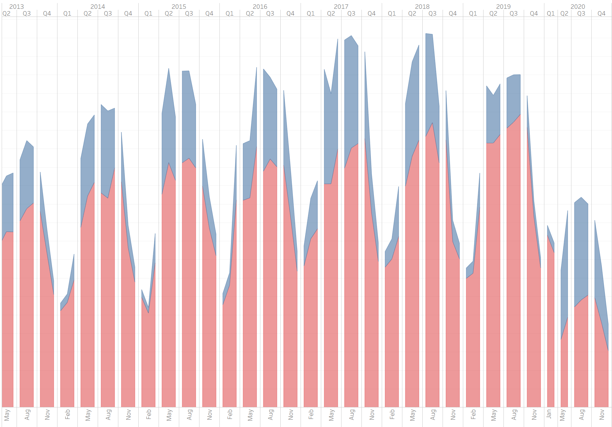

# Final Project

Team 5: Thomas Shane, Paola Escamilla, Takuma Koide, Habtamu Tikuye, Mair Manson, Derrick Amegashie

## Content
### Selected Topic
An analysis of Capital Bike Share service in Washington D.C.

### Reasons for Topic Selection

Intially, we selected analyzing the bike sharing program to explore its social and environmental benefits such as potential impact to lessen traffic congestion and lower CO2 emission, improving resident mobility and accessibility, bettering resident health outcomes, and reducing commute delays for users of the local transportation system. However, we quickly realized the first hurdle to growing the bike sharing programs was financial investment from private investors in partnership with local and federal government agencies. We pivoted to offering a deeper analysis to investors and the local government agencies to undersand the growing membership trends of public bike sharing and rider behavior in Washington DC as a way to encourage further investments and suggesting ways to capitalize on the financial benefits of the expanding rider market.

Advantages of investing in bike sharing programs follow a three-pronged economic model:

#### 1. Data Mining
- use the interest on the reveue collected to invest
- member data has high commercial value to retail businesses, restaurants, car sales
- member data has high value to local governments for urban planning and management
- sell users' riding behavior data captured by app and GPS complement datasets collected by taxi and public transportation systems

#### 2. Advertising
- advertising revenue from ads on physical bike, the app used to locate and unlock the bike

#### 3. Profitability
- Interest earned on Membership deposits is a substantial income generating asset with which to invest
- Huge deposit pool each day from Casual riders

We also pivoted away from pursuing and tracking data sources for income, gender, age, and race to focus on the rider and location trends that are already found in the Capital BikeShare data which were central to our hypothesis that understanding the current rider makeup and behavior was a more than sufficient means to suggest recommendations for where growth opportunities existed in Washington, DC. We also discovered that the exploration of how the riders behaved during the COVID19 shutdown would provide beneficial information to investors for how to prepare for future downturns by being able to quickly adjust their marketing and inventory strategies to mitigate losses and perhaps even grow during a downturn.

### Description of Source Data
Our work used secondary data already collected by the capital bike share service through their website: https://www.capitalbikeshare.com/system-data. 

The data was stored in CSV format files, from 2010 to 2021. 

For the years 2010 and 2011, the daily bike ride information was gathered in a unique CSV file. From 2012 to 2017, the daily bike ride information was gathered in quarterly arranged CSV files and, for the remaining years,  the bike ride information was collected in monthly arranged CSV files.

It must be highlighted that some months had to be disregarded from the analysis due to a lack of data (e.g. year 2020 skipped the month of april and year 2021 ended in may).

In total, our final dataset was created by taking a total of 66 CSV files with over 26,000,000 rows and 8 columns each.

### Analysis Question
Our analysis questions are:

 - Are there rider behaviors we can observe from the ride iniatiation location? 

 - Does weekday or weekend have any effect on riders behavior and their decision to become a member?

 - How have above behaviors changed rates of membership and ridership due to COVID19?

To sustain or refute our hypothesis, the analysis dived into:

- Total bike rides per year
- Distribution of ‘member type’ per station
- 'Time of the day' and 'day of the week' of the ride
- Location of Bike stations (lat, long)

### Description of Data Exploration Phase
The data exploration phase started with a review of the websites of the known bike share services in different cities in the United States. We were able to find available data for the cities of New York, Chicago, Pittsburgh, Boston and Washington D.C. 

Even though all cities showed consistent data we decided to stay with Washington D.C. considering this is the city where all team members live and therefore, we could understand better. 

The data retrieved in the capital bike share website was consistent and showed quality. Each CSV file had the same features/columns aside from 2020 and 2021 where we found a couple of new columns added. For the purposes of our analysis, we disregarded those new addings to maintain the same consistency of the information.

The size of the data collected for each year was considerably large. The amount increased our reliability to the data as we were able to draw some time series in our work. 

## DATABASE INTEGRATION

Before arriving to the ETL Process, and once our data was reviewed and understood, a database, and its relationships, were established to facilitate the transformation process of the data. 

After identifying and organizing the raw data extracted from the capital bike share website, we established five tables to integrate our database: 

These five tables were loaded into a PostgerSQL database. In the image below an example is shown of a table created by "Inner join" from our *station_list* and *station_list_active*.

Based on the above ERD, we continued on transforming datasets further to suit them to visuzalization and Machine Learning processing. The created csv files are available in Google Drive as link below:

[link to Google Drive](https://drive.google.com/drive/folders/1RhGPE1DgXtZ2eRaMr09bNaQkYnRQHske)

## ETL Process
Once with the information identified, our analysis started with an ETL process which aimed to create one big dataset from all the individual CSV files. 
 
The final dataset contained all 28M trips and was conformed by the following columns: 'Trip Number,' 'Starts station number,' 'End station number,' 'start date,' 'end date,' and 'member type'.

From this unified dataset, a series of tables were extracted. In conclusion, we utilized below lists of csv files for analysis:
1. Table 1: all_bike_trips - Lists the 28 million bike trips recorded from 2011 to 2021 May. 
2. Table 4: station_list - the table lists the 650 bike station and their latitude and longitude.
3. Table 9: ratio_df - the table provides each station's ratio of 'member' user over the all trips initiated from the station.
4. Table 10: dayofweek_ratio - the table provides the ratio of 'member' user for each day of week.
5. Table 15: merge_covid - the table organzies each station's ratio of 'member' user and the number of trips took place by using the multi-indexing of whether it was before or after COVID19 and Weekday or Weekend.  
 
## Visual representation of the output:
Table #1 all_bikes_trips

 

Table #4 station_list

Table #9 ratio_df 

Table #10 dayofweek_ratio

Table #15 merge_covid

Column Term | Definition
------------ | -------------
Trip_number	| an arbitrary sequential number assigned to each bike trip in order of `startdate`.
startstationnumber		| the station id number of a bike station that a trip is initiated.
endstationnumber			| the station id number of a bike station that a trip is ended.
startdate		| the time that bike trips has started in YYYY-MM-DD HH:MM:SS format.
enddate	| the time that bike trips has ended in YYYY-MM-DD HH:MM:SS format.
membertype	| the binary column that tells whether the bike trip was done by 'Member' user signed up in the membership or 'Casual' users who rented a bike without signing up the memberhsip.  
weekday		| labels which day of the week the bike trip took place.
station_id		| the same value as `startstationnumber` that identifies specific bike station.
station_name| The name of bike station. Each station name is paired with an unique `station_id`.
lat	| The latitude of a specific bike station.
lng | The longitude of a specific bike station.
ratio		| The ratio of bike trip done by 'Member' users over the all trips took place there.
number_of_members	| The number of times that "Member' users used bikes.
number_of_casuals	| The number of times that "Casual' users used bikes.
trip_total	| The number of times that both 'Member' and 'Casual' users used bikes.
status 	| Labels whether te data refers to `pre_covid` as before the COVID19 or `post_covid` as after the COVID19 pandemic started. In this analysis, the data from 2019/01-2019/12 are grouped as **pre-COVID** and that from 2020/01-2021/05 as **post-Covid**.
WEEKDAY	| the column binary labels **0** as weekday and **1** as weekend

# RESULTS OF ANALYSIS

## DASHBOARD
Note: To access the interactive Tableau Dashboard click on the following links: 

[link to Tableau Dashboard_1 - Public Bike Sharing Project: Loation vs. Membership](https://public.tableau.com/app/profile/takuma.koide/viz/PublicBikeSharingProjectLoationvs_Membership/Loc_Station_ratio?publish=yes)

[link to Tableau Dashboard_2 - Public Bike Sharing Project: Pre vs. Post Bike Sharing Service Trip Trends](https://public.tableau.com/app/profile/takuma.koide/viz/PublicBikeSharingProjectPreandPostCovidComparisonofBikeTrips/Prevs_PostPublicBikeSharingServiceTripTrend?publish=yes)

With the created tables, we used tableau tool to develop visual content to help us uncover the rationality of bike riders. 

With our first visual we uncovered the following:

### Stations per member and casual users
Our first visual crossed the stations of the bike service per type of member.

As the dashboard shows, the stations with greater 'casual' users are those located closest to Points of Interest, such as the national mall, white house, tidal basin and 14th St. This is a predictive behavior as tourists would be less likely to be interested in obtaining a membership of a service that, once they fly back home, will not use again.

Secondly, the dasbhboard shows that stations with greater 'member' type of users are found closest to the corporate hubs, such as Union Station, Dupont Circle, Massachussets avenue, Rhode Island Avenue, Pennsylvania Avenue, Logan Circle.

An additional aspect that we noticed is that stations that show a greater commute advantage showed higher numbers of 'member' riders. 
This prediction was shown accurate when looking at the station located in 15th St & P. The station is located in a convenient city route which (1) counts with a dedicated bike lane and (2) connects conveniently Columbia Heights with dowtown (H Street) therefore being a strategic commute route.

### Number of trips by registered and casual riders
When crossing the number of trips done by both registered and casual riders we got the following visual:

As it can be seen, indeed the mayority of bike trips have been taken by member riders (registered) than by casual ones. This observation is a very predictive pattern considering that by thinking of 'membership' already speaks of a very loyal and frequent user audience.

In a glance, the 'member' type ratio increased steadily until 2019. However, the ratio between member and casual drastically reverses in 2020 due to the covid 19 pandemic. We will reassess this impact in the map again to identify the most current behavior of users.

### Pre-Covid and Post-Covid Bike Users Trend
The third visuals compared the change in both bike ride trends and the ratio of member usage between Pre-Covid and Post-Covid:

#### Pre-Covid:

#### Post-Covid:

These visuals shows that not only overall volume of bike ride reduced around corporate hubs by change in the data point size, the overall ratio of 'member' usage converted to 'casual' as the color shifted to blue from red.

This is also a predictive behavior as, if 'member' type riders use the service more for commute and transportation to work, we would see less riding by those users when Covid was focing many to work remotely (or overall workforce was declined).

Also, when commuting is not consistent, those 'member' users could have turn themselves into 'casual' users based on less frequent need of riding a bike. 

There are three takeaways from these visuals:

1. The 'member type' of bike users are largely depended on the location of bike stations and whether Weekday or Weekend that they are riding. Thus we can identify that purpose of their bike ride is either for commuting or sightseeing.
2. However, such trend was impacted by Covid that overall trip ride and 'member' usage were declined due to nnecessity of consistent commuting. Rather, we see increase in 'casual' rider in 2020 for both corporate hubs and point of interest.
3. Based on the above points, PBS must reasses the popular bike stations to focus their resource and adjust their membership plan price to re-convert the 'casual' riders back to 'member' riders.

## MACHINE LEARNING

In the machine learning part of our project, we try to predict future growth of bikesharing in DC. Using timeseries data and ARIMA model the project performs trend analysis and predict future prospect of the bike sharing.
This project tries to achive two main goals in this time series analysis. First, it identifies the sequence of observations , and second, predict the future values of the the timeseries univeriate variable(**Number of Trips**).

 - **Visualizing time series**
 Looking at below chart we can see the upward trend of *Number of trips* from 2010 till 2018.
 

Regarding timeseries analysis our series needs to be stationary (i.e *Number of trips* should have a constant mean, variance and covariance). However, as we can see the above chart,the mean is not constant.This implies our series is not stationary.

We can also visualize the normal distribution of our timeseries data using a probablity distribution.

To get a more clear insight of our timeseries data, we will plot the **level**, **Trend**, **Seasonality**, and **Noise** charts.These charts explains the average value in the sseries, the increasing or decreasing value in the series, the repeating short-term cycle in the series, and the random variation in the series respectively.

Looking at the above charts there is an upward trend and a recurring event where number of bike trips shoots maximum every year.

  - **Stationarising the time series**

 First, we check if our series is stationary or not. We use ADF(Augmented Dickey-Fuller) Test, as it can be used to determine the presennce of unit root in the series and also determine if the series is stationary or not.
 *Null Hypothesis(H0)*: The series has a unit root
 *Alternative Hypothesis(H1)*: The series has no unit root.
 
 

As we can see the above image the p-value is greater than 0.05. Thus, we fail to regect our null hypothesis.We can coclude ourseries is not stationary. To get a stationary series, we need to eliminate the trend and seasonality from the series.  we do that by taking a log of the series to reduce the magintude of the values and reduce the rising trend in the series. Then,we find the rolloing average of the series. 

After finding the mean, we take the difference of the series and the mean at everypoint in the series.Therfore, we eliminate trends out of a series and obtain a more stationary series. Now, we can perform the Dickey-Fuller test(ADFT) once again to check if our series attained stationarity.

Using the same rules of P-value we can clearly see our series attained stationarity.

This project takes membership status as a variable of interest and it is a classified variable(*member* and *caslual*). Therfore, we have moved to using a prophet model instead of ARIMA to forcast how membership status has behaved during the pandemic season and how significant it is for the investors decision.

## PROPHET MODEL:

We chose to use the Facebook Prophet model because it is also a time series forecasting algorithm and because it easily handles the weekly and yearly seasonality contained in our data. We used the Prophet model to predict 'Member' rider growth for the next 36 months.

### Preprocessing

The 'membertype' target column was encoded for the 'member' and 'casual' riders from strings to numerical data for the algorithm to understand the two categories. Then the 'casual' riders were dropped, and the 'startdate' column was converted from an object to a datatime data type. The columns were then renamed because Prophet requires the use of specific column names; 'ds' for dates and 'y' for the target variable we're predicting.

The 22 million datapoints of our dataframe were too many to run on any of Google Colab's free server runtime types, so we binned the observations from a daily, minute-by-minute tally to weekly summed totals. This reduced the dataframe to a more manageable 486 datapoints.

### Train and Fit the Model

Since rider data from 2020 and 2021 were atypical, due to COVID19 restrictions, and didn't represent the previous years' rider behavior, we limited our model to using the rider data from 2010 - 2019. 

We created the train dataset with datapoints from 2010-2017 and test dataset to 2018-2019.

### Forecast and Plot

When making predictions with Prophet, we're required to create a special object called 'future_data' which is a Pandas DataFrame with a single column (ds) that includes all datetimes within the training data, plus the additional periods from the 'test' split. Our time series has a clear yearly cycle with summer months higher member rides and tapering off in the winter months.

### Trend and Seasonality

Prophet also returns components of our forecasts which show how weekly and yearly patterns contribute to the forecasted values. The first plot shows that member weekly rides has been gradually increasing over time. Although the overall growth trend has been gradual, it has risen steadily year over year. The weekly trend shows higher weekend usage suggesting that members may not be using bikes for commuting or errands and more for recreation. The seasonal yearly trend shows peak member usage in the spring and fall seasons following Washington, DC's most moderate weather temperatures during those few weeks in late June and early October.

## RECOMMENDATIONS FOR FUTURE ANALYSIS
Exploring and visualizing the data confirmed our hypothesis that overall bike usage will continue to grow and that there are many ways to incentivize casual riders to convert to become a bike sharing member. 

The analysis confirms that member riders initiate trips more during weekdays than weekends, casual members explore more the 'point of interest' areas than the member riders. Riders, in general, ride less during winter than summer. 

A hypothesis that corelating annual growth of memberships by station location could reasonably predict future stations based on locations with features such as nearby shopping, schools, restaurants and entertainment. Availability of way to locate this data from geolocation information from Google Maps and incorporate this option was difficult to explore for lack of time in this project, but could prove significant in the future.

The predictability seen in the data makes it easier for the bike sharing service investors and stakeholders to make solid decisions to maintain and grow the current market. 

Considering a future pandemic scenario, from the evidence seen in the analyis of rider behavior during COVID19, investors and stakeholders can explore the establishment of a contingency plan where some resources can be saved:

- Explore the adjustment of membership costs in order to expand enrollment;
- Explore the reduction of bike stations to ensure that: (1) there is more bike availability in those most used at the moment, (2) the less used bike stations are temporarily suspended to decrease maintenance costs.
